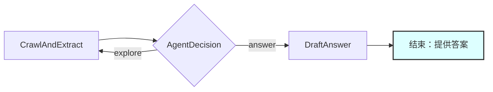

# 设计文档：网页支持机器人

> 请不要删除AI的备注

## 需求

> AI备注：保持简单明了。

> 如果需求抽象，请编写具体的用户故事。

AI支持机器人应：

1. 接收多个起始网页URL和一个初始用户问题作为输入

2. 对于后续问题，重用之前爬取的数据和对话历史

3. 同时从多个网页中提取内容并识别所有可用的链接

4. 作为智能代理，能够：

- 根据当前可用内容和对话历史起草对问题的回答

- 决定是否探索更多链接以获取更多信息

- 拒绝与网站内容无关的问题

- 批量处理多个URL以提高效率

**用户故事：**

- 作为用户，我希望提供多个起始URL（例如，主站+文档站）并询问“你们的退货政策是什么？”以获得全面的答案

- 作为用户，我希望机器人拒绝与电子商务网站内容无关的问题，如“天气怎么样？”

- 作为用户，我希望机器人同时探索多个页面（常见问题解答、产品页面、支持文档）以提供全面的答案

- 作为用户，在提出初始问题后，我希望提出后续问题，如“国际订单怎么办？”并让机器人使用先前上下文来回答，如果需要，可能还会爬取更多页面

## 流程设计

> AI备注：

> 1. 考虑代理、map-reduce、rag和工作流的设计模式。如果适用，请应用它们。

> 2. 提供简洁、高级的工作流程描述。

### 可适用的设计模式：

1. **代理模式**：核心决策逻辑，确定是否回答、探索更多链接或拒绝问题

2. **RAG模式**：检索网页内容以增强回答生成

3. **Map-Reduce模式**：批量同时处理多个URL

4. **工作流模式**：按顺序处理网页批量，然后进行代理决策和回答生成

### 高级流程设计：

1. **CrawlAndExtract**：批量同时处理多个URL以提取干净的文本内容，并发现那些页面上的所有链接

2. **AgentDecision**：核心代理，分析用户问题与可用内容，并决定下一步行动：

- `answer`：移动到回答生成（包括常规答案和拒绝）

- `explore`：访问更多链接（并选择下一个要探索的URL）

3. **DraftAnswer**：在决策为“answer”时，根据收集到的知识生成最终答案（处理答案和拒绝）



## 工具函数

> AI备注：

> 1. 通过审查文档彻底理解工具函数的定义。

> 2. 根据流程中的节点仅包含必要的工具函数。

1. **调用LLM** (`utils/call_llm.py`)

- *输入*：提示（str）

- *输出*：响应（str）

- *必要性*：由AgentDecision节点用于决策和DraftAnswer节点用于回答生成

2. **网络爬虫** (`utils/web_crawler.py`)

- *输入*：url（str），allowed_domains（list[str]）

- *输出*：包含（clean_text_content（str），list_of_links（list[str]））的元组

- *必要性*：由CrawlAndExtract节点用于获取网页内容并提取所有链接的单个操作

3. **URL验证器** (`utils/url_validator.py`)

- *输入*：url（str），allowed_domains（list[str]）

- *输出*：is_valid（bool）

- *必要性*：由CrawlAndExtract节点用于过滤允许的域内的链接。如果allowed_domains为空，则允许所有有效的URL（无域过滤）

## 节点设计

### 共享存储

> AI备注：尽量减少数据冗余

共享存储结构组织如下：

```python

shared = {

"user_question": "What is your return policy?", # 输入：用户的当前问题

"conversation_history": [], # 输入：包含{"user": "question", "bot": "answer"}的列表

"instruction": "Focus on finding official policies and procedures. Prioritize FAQ and help pages.", # 输入：如何回答和爬取的说明

"allowed_domains": ["example.com"], # 输入：允许探索的域列表（例如，["example.com", "support.example.com"])

"max_iterations": 5, # 输入：在强制回答之前的最大探索迭代次数

"max_pages": 100, # 输入：要访问的最大页面数（默认：100）

"content_max_chars": 10000,
